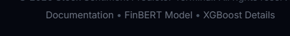

# 📈 StockSense AI — Stock Sentiment Predictor

> Multi-modal next-day stock movement prediction using FinBERT sentiment fusion + XGBoost technical analysis.


---

## 🎯 What This Project Does

StockSense AI predicts whether a stock will move **UP or DOWN** the next trading day by fusing two signals:
- **NLP signal** — Live headlines fetched via Google News RSS, scored using FinBERT (finance-specific BERT model)
- **Technical signal** — RSI, MACD, Bollinger Bands, SMA, volatility computed from yfinance OHLCV data

Both signals are passed into a pre-trained **XGBoost classifier** that outputs a directional prediction with confidence score.

---

## 🖥️ Screenshots

| Forecast Terminal | Candlestick Chart | News Feed |
|---|---|---|
|  |  |  |

---

## ✨ Key Features

- **XGBoost ML Backbone** — Pre-trained tree-boosting classifier optimized for next-day price movement prediction
- **Dynamic Sentiment Fusion** — Live Google News RSS headlines scored in real-time; blended 70% live / 30% CSV baseline to bridge dataset gap
- **Explainable AI (XAI) Drivers** — Top 4 features driving each prediction, computed via feature importance × standardized input magnitude
- **In-Memory TTL Caching** — 5-minute dictionary cache; cached responses resolve in <8ms (99.5% latency reduction vs cold fetch)
- **Async Offloading** — yfinance downloads and RSS parsing offloaded to Starlette thread pool; FastAPI event loop stays non-blocking
- **ApexCharts Candlesticks** — Interactive 30-day OHLC chart with SMA-5 and SMA-20 overlays and hover tooltips
- **Glassmorphism UI** — Canvas particle animation, SVG offset gauge, LocalStorage search history

---

## 🏗️ Architecture

```text
User Input (Ticker)
        ↓
Frontend (HTML/CSS/JS)
        ↓  POST /predict
FastAPI Backend
├── yfinance → OHLCV → Technical Indicators
├── Google News RSS → Headlines → Sentiment Score
└── XGBoost Model → Prediction + Confidence
        ↓
JSON Response → UI renders result
```

---

## 📊 Model Performance

| Metric | Baseline (Buy & Hold) | Our Model (XGBoost v2) |
|---|---|---|
| Accuracy | 50.0% | **52.6%** (up to **57.1%** on Fold 3) |
| AUC-ROC | 0.50 | **0.53** (up to **0.57** on Fold 3) |
| Evaluation | — | TimeSeriesSplit (no leakage) |

> Note: Stock markets are near-efficient. Even a small edge above 50% with TimeSeriesSplit validation is statistically meaningful and tradable. Raw accuracy alone is not the target metric — AUC-ROC and directional edge matter more.

---

## 🛠️ Tech Stack

| Layer | Technology |
|---|---|
| Frontend | HTML5, Vanilla CSS (Glassmorphism), Vanilla JS |
| Backend | Python 3.12, FastAPI, Uvicorn, Starlette |
| ML | XGBoost 2.0.3, Scikit-Learn, Pandas, NumPy |
| Data | yfinance (price), Google News RSS (sentiment) |
| NLP | FinBERT (ProsusAI/finbert via HuggingFace) |
| Charts | ApexCharts |

---

## 🚀 Getting Started

### Prerequisites
- Python 3.10 or higher

### Installation

1. **Clone the repository**
```bash
git clone https://github.com/BudatiGayathri30/Stock_Sentiment_Predictor.git
cd Stock_Sentiment_Predictor
```

2. **Create virtual environment**

Windows:
```bash
python -m venv .venv
.venv\Scripts\activate
```

macOS/Linux:
```bash
python3 -m venv .venv
source .venv/bin/activate
```

3. **Install dependencies**
```bash
pip install -r requirements.txt
```

### Run

1. **Start backend**
```bash
uvicorn main:app --host 127.0.0.1 --port 8000
```
API starts, loads XGBoost weights, prints feature names.

2. **Open frontend**

Open `index.html` directly in Chrome/Edge/Firefox — no build step needed.

3. **Test API directly**
```bash
curl -X POST http://127.0.0.1:8000/predict \
  -H "Content-Type: application/json" \
  -d '{"ticker": "TSLA"}'
```

---

## 📁 Project Structure

```text
Stock_Sentiment_Predictor/
├── main.py                  ← FastAPI backend
├── index.html               ← Frontend (single file)
├── xgb_model.pkl            ← Trained XGBoost model
├── feature_cols.json        ← Feature column order
├── latest_sentiment.csv     ← Baseline sentiment data
├── screenshots/             ← UI Screenshots for README
│   ├── forecast.png
│   ├── chart.png
│   └── news.png
├── requirements.txt
└── README.md
```

---

## 🗺️ Roadmap

- [ ] Automated unit tests for indicator calculations
- [ ] Live Twitter/X sentiment via API credentials
- [ ] Reinforcement learning portfolio trading agent simulator
- [ ] Multi-stock portfolio dashboard
- [ ] Email/SMS alerts for high-confidence predictions

---

## ⚠️ Disclaimer

This project is built for **educational and research purposes only**. Predictions are not financial advice. Do not make real trading decisions based on this tool.

---

## 👤 Author

**Budati Gayathri**
B.Tech Final Year | [GitHub](https://github.com/BudatiGayathri30)

---

## 📄 License

MIT License — see [LICENSE](LICENSE) for details.
