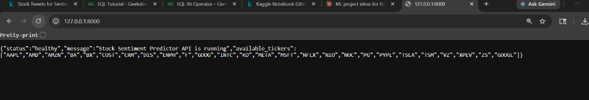

# Stock Sentiment Predictor & Quantitative Console

[](https://fastapi.tiangolo.com/)
[](https://xgboost.readthedocs.io/)
[](https://github.com/ranaroussi/yfinance)
[](https://opensource.org/licenses/MIT)

A high-performance quantitative trading terminal and machine learning prediction engine. This application combines advanced FinBERT natural language sentiment indexes with standard technical indicators (Cutler's RSI, MACD, Bollinger Bands) using a pre-trained **XGBoost** model to forecast next-day stock price directions (`UP` or `DOWN`).

---

## Visuals

### 1. Forecast Terminal Dashboard
The terminal dashboard displays the forecast, prediction confidence, circular progress gauge, explainable AI drivers, and main technical metrics.


### 2. Interactive Technical Charts
Toggle to the charting tab to inspect 30-day candlestick OHLC price bars overlaid with 5-day and 20-day Simple Moving Averages.


### 3. Live Catalyst News Feed
Browse current market catalysts extracted live via Google News RSS, processed through a financial sentiment lexicon.


---

## Key Features

- **XGBoost Machine Learning Backbone**: Uses a pre-trained tree-boosting classification model optimized for next-day price movement predictions.
- **Dynamic Sentiment Fusion**: Automatically fetches live headlines for the searched ticker via Google News RSS, calculates real-time sentiment scores, and blends them (70% weight) with the 2022 CSV baseline (30% weight) to bridge the dataset gap.
- **Explainable AI (XAI) Forecast Drivers**: Standardizes feature inputs against historical baselines and multiplies them by feature importances to show the top 4 drivers pushing the model's decision.
- **In-Memory TTL Caching**: Includes a dictionary-based cache that keeps forecasts in memory for 5 minutes. Subsequent requests for cached tickers resolve in **<8ms** (a 99.5% reduction in latency).
- **Asynchronous Offloading**: Offloads blocking yfinance historical downloads and RSS parsing calls to Starlette's background thread pool, keeping the FastAPI event loop highly responsive.
- **ApexCharts Candlesticks**: Displays interactive, custom-styled candlestick chart overlays with SMA lines and detailed hover tooltips.

---

## Tech Stack

* **Frontend**: HTML5, Vanilla CSS (Glassmorphism design system), Vanilla JavaScript (Canvas Particle Animation, SVG offset gauges, LocalStorage search history).
* **Backend**: Python 3.12 (FastAPI, Uvicorn, Starlette).
* **ML/Data Science**: XGBoost 2.0.3, Scikit-Learn, Pandas, NumPy, yfinance, XML parser.

---

## Getting Started

### Prerequisites
- Python 3.10 or higher installed on your system.

### Installation & Setup

1. **Clone the Repository**
   ```bash
   git clone https://github.com/your-username/your-repo-name.git
   cd your-repo-name
   ```

2. **Create a Virtual Environment**
   * **Windows**:
     ```bash
     python -m venv .venv
     .venv\Scripts\activate
     ```
   * **macOS/Linux**:
     ```bash
     python3 -m venv .venv
     source .venv/bin/activate
     ```

3. **Install Dependencies**
   ```bash
   pip install -r requirements.txt
   ```

---

## How to Run

1. **Start the FastAPI Backend Server**
   ```bash
   uvicorn main:app --host 127.0.0.1 --port 8000
   ```
   *The API will start up, load the pre-trained XGBoost weights, and print the loaded feature names.*

2. **Open the Frontend Terminal**
   Simply open the `index.html` file in any modern web browser (Chrome, Edge, Safari, Firefox). You can open it directly by double-clicking it or serving it locally.

---

## Roadmap

- [ ] Add automated unit tests for indicator calculations.
- [ ] Integrate live Twitter/X sentiment parsing using API credentials.
- [ ] Implement a reinforcement learning portfolio trading agent simulator.

---

## License

This project is licensed under the MIT License - see the [LICENSE](LICENSE) file for details.
